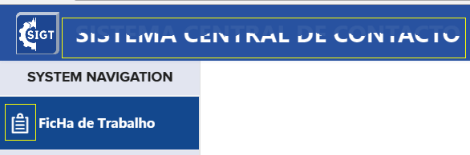

2020-年中研发部技能考核（题一）
===

#  1：题目要求

+ 高保真还原效果图，具体文字内容也需要保持和效果图一致；
+ 工程可运行，运行后，呈现还原效果
+ 首页REMADE.md 结合自身项目情况作说明介绍

# 2：运行

## 2.1  安装

```shell
npm install
```

## 2.2 开发环境运行

```shell
npm run start
```

## 2.3 生产环境 build

```shell
npm run build
```

运行成功后，浏览器输入指定地址（默认<http://localhost:8080/>），进入考核页面。

> 为保证界面效果，登录后请进入`全屏`预览（默认按`F11`）,为了演示Loading效果增加使用了`setTimeout`。

#  3：设计思想

##  3.1 主题

根据原型图，结合实际项目，修改`elemenUI`主题颜色。

修改`src/themes/white/variables.scss`中的主体颜色、统一`elementUI`风格

````scss
$--color-primary: #1d4691 !default;
````

##  3.2 字体

 导入需要的`iconfont`和文字字体文件、同时在`src/themes/white/theme.scss`和`src/themes/black/theme.scss`对字体进行引用。


````scss
@font-face{
  font-family: 'ProximaNovaBold';
  src: url(../icons/ProximaNova-Bold.ttf)format("truetype");;
  font-style: normal;
  font-weight: normal;
}
````

##  3.3 公共样式文件设计

````shell
│  ├──assets                                 
|  ├──├── style
|  ├──│   ├── base
|  ├──│   │	  └── reset.scss                全局样式、重置默认样式文件
|  ├──│   ├── helper
|  ├──│   │   ├── mixin.scss                混合(Mixin)文件
|  ├──│   │   └── screen.scss               响应式分辨率样式文件
|  ├──│   ├── special
|  ├──│   │   ├── animation.scss            动画样式文件
|  ├──│   │   ├── element-ui.scss           修改element-ui样式文件
|  ├──│   │   └── iconfont.scss             修改iconfont文件
|  ├──│   ├── themes
|  ├──│   │   ├── black.scss                夜晚模式样式文件
|  ├──│   │   ├── theme.scss                皮肤公共样式
|  ├──│   │   ├── variables.scss            全局通用样式文件
|  ├──│   │   └── white.scss                白天样式文件
|  ├──│   ├── index.scss
````

需要 在 vue.config.js 文件中进行打包配置

````javascript
  css: {
    loaderOptions: {
      sass: {
        prependData: `@import "@/assets/styles/index.scss";`
      }
    }
  },
````

##  3.4  布局

分析整个页面布局为上下结构，主体部分左侧包括菜单和内容页，使用的`container`布局容器进行布局。

````html
<el-container class="layout-container">
    <el-header >
        <Header />
    </el-header>
    <el-container class="layout-main">
        <el-aside width="250px" :class="{'hidden-aside':isSidebar}">
            <SliderBar />
        </el-aside>
        <el-main>
            <transition :name="transitionState" >
                <router-view class="main">
                </router-view>
            </transition>
        </el-main>
    </el-container>
</el-container>

````

##  3.5 工程目录组件化

将`基础页面` 和 `业务页面`分开

````shell
├─ src/
    ├─ components
        ├─ header-components
            ├─ close.app        
            ├─ menu
            ├─ user-info
        ├─ ...
    ├─ views
        ├─ header
    ├─ ...
├─...
````

## 3.6 公共组件

子组件预留`slot`父组件可以进行填充

````html
<div class="commom-tilte">
    <p class="title">{{title}}</p>
    <div class="operate-btn">
        <slot name="add"></slot>
        <slot name="delete"></slot>
    </div>
</div>
````

##  3.7 公共样式 

可使用@mixin()

````scss
/*
 * iconFont hover效果
 * $hoverColor hover时的颜色
*/
@mixin iconFontHover($hoverColor) {
  cursor: pointer;
  &:hover {
    color: $hoverColor;
  }
}

.icon-power-off {
  @include iconFontHover(#fff);
}

````

##  3.8 过滤器的使用

````typescript
import Vue from 'vue';

Vue.filter('status-icon', (status: any) => {
  if (status) {
    return `iconfont icon-succeed`;
  } else {
    return `iconfont icon-defeated`;
  }
});
````

#  4：亮点

在高保真还原效果图的前提下对考核进行的一些优化。

##  4.1 功能完整

简单实现了页面数据的刷新、搜索、删除功能


**实现方式**

>模拟数据存储在public/data.json文件
>
>通过`Vuex`对数据进行简单的持久化
>
>对数据进行操作实现简单功能

##  4.2 响应式布局


`F12`打开控制台、点击左上角手机标志可以进行手机模拟查看。也可以直接对浏览器窗口进行缩放操作查看。

**实现方式**

> 使用`flex`布局。
>
> 使用`rem` 对字体大小、宽、高、间距进行比例缩放。
>
> 使用媒体查询元素@media screen 对不同分辨率模块显示做适配。 

##  4.3  换肤（白天、黑夜模式切换）


点击`radio`按钮切换不同的主题

**实现方式**

>准备俩套皮肤的公共样式皮肤。可看`src/assets/style/themes/theme.scss`。
>
>通过`sass`的`map-get`方法对全局变量进行封装。
>
>通过body加载不同的class，加载对应的css文件实现换肤功能。

##  4.4  自定义指令


为了展示此效果、特意加了个定时器。

点击`刷新`按钮可查看效果

**实现方式**

>使用vue的`directives `。可看`src/common/directives/`文件夹。
>
>通过 `DirectiveOptions ` 暴露的接口进行DOME 的操作。
>
>给添加的DOME 编写样式。
>
>main.ts 文件中对`directives `进行全局引用。
>
>在需要使用的地方进行使用 `v-customLoading="loading" `

##  4.5  路由切换动画

可切换菜单查看效果

**实现方式**

> 路由中添加`meta ` `index`值。
>
> 通过监听路由中`index`的的变化、判断当前路由方向。
>
> 为`transition `标签添加`name`属性。

##  4.6  简单动画



**相关CSS属性**

>`animation` `transform` `background-clip `

